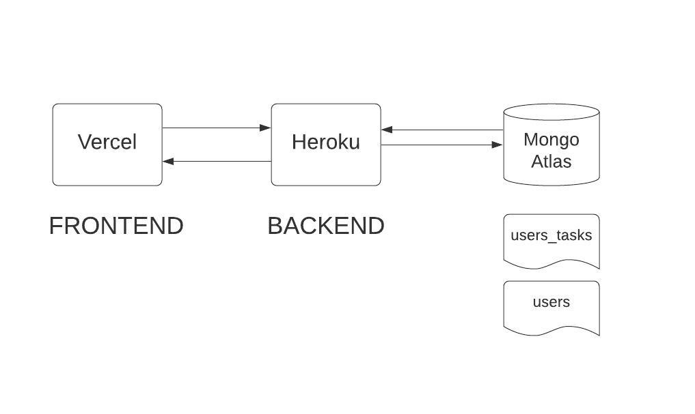

# To Do App ✔️

Web app that allows the user **_create_**, **_edit_** and **\*delete** users and manage their tasks.

URL: [To Do App](https://todo.angelygranados.com/)

[Backend Code](https://github.com/angelygranados/to_do_app_backend)

 

## Architecture Diagram

## Available Scripts

In the project directory, you can run:

### `npm install`

Install all the dependencies

### `npm start`

Runs the app in the development mode. 
Open [http://localhost:3000](http://localhost:3000) to view it in the browser.

The page will reload if you make edits. 
You will also see any lint errors in the console.

### `npm run build`

Builds the app for production to the `build` folder.

## Dependencies

- react: ^17.0.0
- react-dom: ^17.0.0
- react-redux: 6.0.1
- redux: 4.0.1
- redux-thunk: 2.3.0
- react-router-dom: ^5.2.0
- react-scripts: 3.4.3
- node-sass: ^4.14.1
- prop-types: 15.7.2
